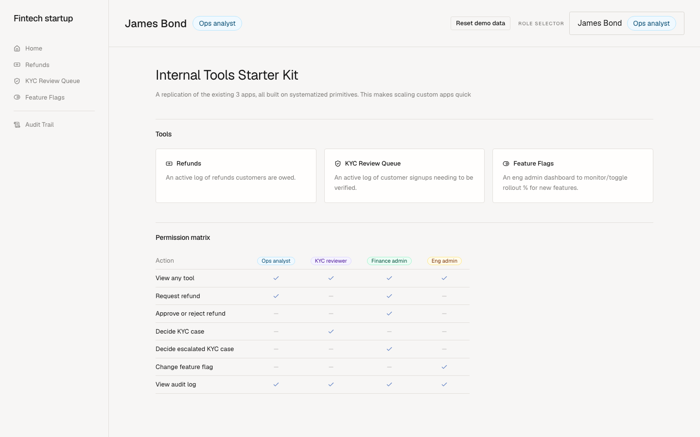

# Internal Tools Starter Kit

- **Working prototype:** https://cognition-devin-takehome.vercel.app/
- **Presentation:** https://cognition-takehome-presentation.vercel.app/

An internal tools start kit to allow scaling to 10 apps fast with Devin. See [SPEC.md](SPEC.md) for full brief.

## Prototype Scope

Internal Tools Starting Kit: build the 3 existing Power Apps on a shared primitive foundation (KYC review queue, refunds dashboard, feature-flag panel)

- Role-based permissions, audit log, reusable UI components
- 3 apps because that proves the foundation holds. 1 app proves Devin can write a web app, but apps 2 and 3 show that the playbook from 1 is reusable.

## Architecture

Each layer only talks to the one below it.

| Layer | Where | What it does |
|---|---|---|
| Pages | `app/<tool>/`, `components/kit/` | Frontend |
| Server actions | `app/<tool>/actions.ts` | Get user, call business function, return error |
| Domain business rules | `lib/<tool>.ts` | Product logic: who can approve a refund, when a KYC case must escalate. |
| Foundation write path | `lib/mutation.ts`, `lib/authorize.ts`, `lib/audit.ts` | shared by all tools (who is the user, what are their permissions, how changes get written, writing audit records) |

## Prototype Walkthrough

- **Home**: one card per tool + the permission matrix
  - **Role Selector**: selector in the top right that swaps between five seeded people
- **Refunds**: an active log of refunds customers are owed. $500+ needs two
  distinct admin approvals (a requester can't decide their own).
- **KYC Review Queue**: an active log of customer signups needing to be verified (oldest first). Cases scoring 70 or above are escalated to a KYC reviewer, then decided by a Finance admin.
- **Feature Flags**: an Eng admin dashboard to monitor/toggle rollout % for new features.
- **Audit**: a permanent record of every change made through this app

## Build Process

**Session 1** built the spec, the foundation (permissions, audit, layout,
tables), the Playbook, and Refunds page. **Session 2** built KYC and Flags pages by following the
Playbook end to end.

The Playbook reduces a new tool to: one line in the tool registry, a domain module, and a
page (table + detail card + action dialog) with tests.

## Limitations/Tradeoffs

Didn't build: real sign-in, production database config, deployment plumbing.

Tradoffs:

- **Power Apps gives identity, permissions, audit, and governance without an engineer.**
  Here they are code we own (we must review and maintain).
- **No drag-and-drop for non-engineers.** Every tool is a spec + Devin session + PR review.

## What Needs to Happen in Prod

- **Real sign-in**: Entra SSO end-to-end, group-to-role mapping, `view-as` switcher removed
- **Postgres instead of SQLite**
- **Platform plumbing**: monitoring, alerting, rate limiting, security headers
- **Secrets management**: rotation, separate values per environment
- **Deployment pipeline**: dev/staging/prod, protected `main`, tests before merge
- **Audit retention and export**: retention windows, CSV/warehouse export for compliance